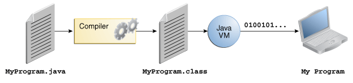
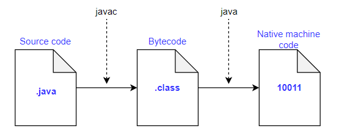

# JVM, JRE, JDK, Java
우리가 작성한 소스 코드는 어떻게 실행이 되는 것일까?  
아쉽게도, CPU는 이진수로 이루어진 기계어(Machine Language)를 이해하지 한국어를 이해하지는 않는다.  

그래서 우리가 작성한 코드는 모두 기계어로 변환이 되어서 실행 되는데,  
한 가지 알아야 할 것은 <b>기계어는 하드웨어에 종속적</b>이다는 것이다.

Java 공부 중이니까, Java로 이 과정을 한번 알아보자.

  
※ 출처 : https://docs.oracle.com/javase/tutorial

  
※ 출처 : https://www.educative.io/

자바로 작성한 소스 파일은 `.java` 확장자를 가진다.  
이 소스 파일을 `javac` 컴파일러로 컴파일을 하면 `.class` 파일이 나온다.  
`.class` 파일에는 프로세서에 특화된 코드 대신 Java VM(JVM)의 기계어인 `바이트 코드(bytecodes)`가 들어있다.  

그런 다음에 `java` 런처 도구는 JVM으로 어플리케이션을 실행한다.  
`JVM`은 bytecode를 각 하드웨어에 맞는 기계어로 변환한다.

  
※ 출처 : https://docs.oracle.com/javase/tutorial

`JVM`은 여러 OS에서 사용할 수 있기 때문에, 같은 `.class` 파일을 어느 OS에서도 실행할 수 있다! (Write once, run anywhere. WORA)  
한 번 컴파일 된 `.class`파일은 JVM이 설치된 어떤 OS에서도 사용할 수 있다는 의미다.
> ✔ Java는 플랫폼에 종속적이지 않다! 하지만 JVM은 종속적이다.

여기서 JIT 컴파일러를 사용해서 native(OS에 특화된)한 기계어로 변경하고, 인터프리터로 실행한다.

> ❔ CPU가 이진수를 읽고 어떻게 명령으로 처리하는 지 궁금하다.  
❔ 기계어가 하드웨어에 종속적이다는 것을 보여주는 예시가 있을까? (MIPS 같은건가?)  
❔ 컴파일 링크 빌드..

## 1. JVM (Java Virtual Machine / 자바 가상 머신)
* JRE의 일부다.
* 자바 바이트 코드를 OS에 특화된 코드로 변환한다. (인터프리너 JIT 컴파일러)
* 특정 플랫폼에 종속적임.
* 최소 배포 단위가 JRE이다.
* 일종의 스펙이다.(명세) → 여러 vendor
* JVM은 원래 자바 언어를 위한거였는데, 스칼라, 그루비, 코틀린 등 다른 언어도 지원함.

## 2. JRE (Java Runtime Environment)
* 자바 어플리케이션을 실행하는 것이 목적. → JVM 포함 
* JVM과 핵심 라이브러리, 리소스 파일(rt.jar, charsets), property setting을 가지고 있음.
* 하지만 자바를 개발하는데 필요한 툴은 제공되지 않는다. (실행하는 것이 목적이기 때문!)
* 자바 컴파일러는 없지만, java 명령어는 있어서 실행은 가능하다.

> ✔ JRE : JVM + Library

## 3. JDk (Java Development Kit)
* javac 포함.
* 개발에 필요한 툴까지 포함.
* oracle java11부터는 JDK만 제공하고 JRE는 제공하지 않는다.
* java9부터 생긴 module 시스템으로 JRE 비슷하게 만들 수 있다. jlink (모듈의 subset을 만들 수 있음.)

> ✔ JDK : JRE + 개발 툴

## 4. Java
* 프로그래밍 언어.
* 오라클의 Oracle JDk 11 버전부터 상용으로 사용할 때 유료.
* JDK에 들어있는 javac를 사용하여 바이트코드(.class 파일)로 컴파일 할 수 있음.
* https://medium.com/@javachampions/java-is-still-free-3-0-0-ocrt-2021-bca75c88d23b

 
 
어떤 언어를 컴파일했을때 클래스 파일이 생긴다면, JVM을 활용할 수 있다.
위에서 서술한 것 처럼 스칼라, 그루비, 코틀린이 있는데 그 중 Kotlin 예시를 보겠다.

### Kotlin
`kotlinc KotlinClass.kt -include-runtime -d kotlin.jar`
`-include-runtime` 하지 않으면 그냥 kotlinc KotlinClass.kt 를 했을 때, NoClassDefFoundError : kotlin/jvm/internal/Intrinsics 예외가 발생함.
위의 명령어로 한다면, runtime에 필요한 파일을 jar 파일에 같이 넣음.

`java -jar kotlin.jar` 명령어로 실행할 수 있다.

결론! class 파일은 JVM에서 실행할 수 있다.

> ❔ jar(jar (Java Archieve) file), javac, javap

## REFERENCE
* Java Tutorial - About the Java Technology  
https://docs.oracle.com/javase/tutorial/getStarted/intro/definition.html

* educative.io - What is Java virtual machine (JVM)  
https://www.educative.io/answers/what-is-java-virtual-machine-jvm
