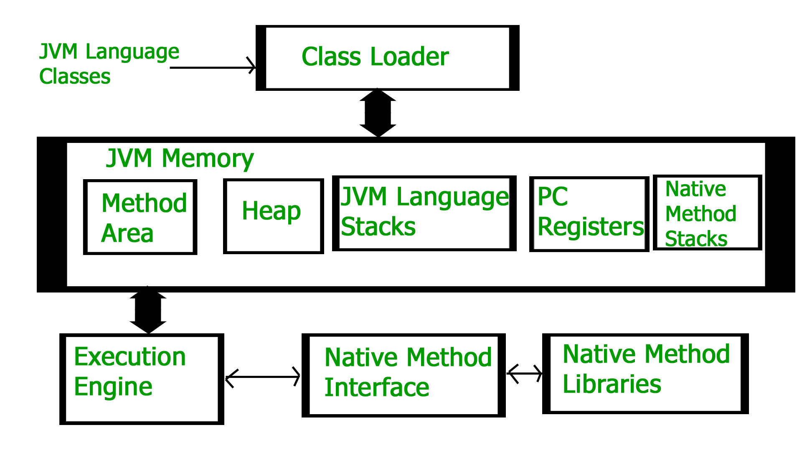
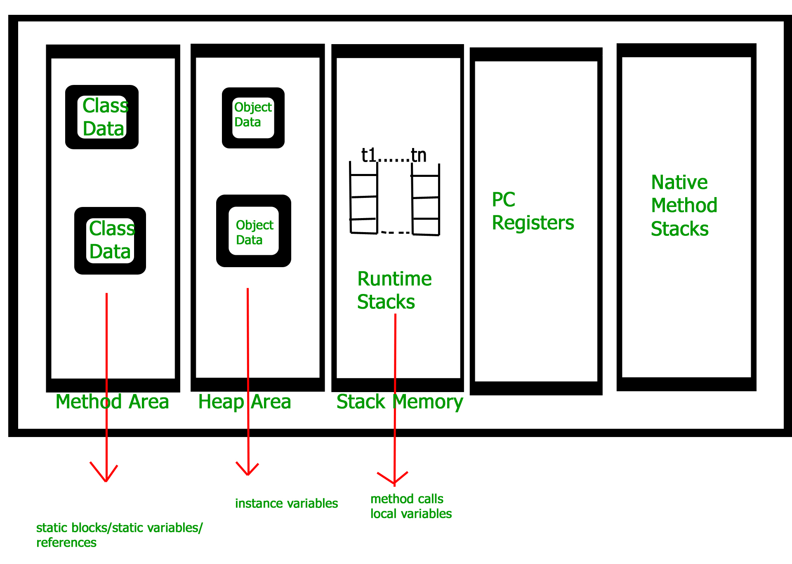

# JVM 구조

※출처 : https://www.geeksforgeeks.org/

JVM은 5가지로 나뉘는데, 아래처럼 4가지로 볼 수 있다.
* Class Loader
* Memory
* Execution Engine(실행 엔진)
* Native Method Interface, Native Method Libraries

하나씩 알아보자.

## 1️⃣ Class Loader System
컴파일된 .class 파일의 바이트코드를 읽어서 매모리에 적절하게 배치한다.  
주로 다음의 3가지 일을 하는데, 이번 장은 간략하게만 보고 자세한 내용은 다음 장에서 보자.
* Loading : 클래스파일의 바이트 코드를 읽어서 Memroy 영역에 저장한다.
* Linking(링크) : 레퍼런스 연결. 세세하게 나뉜다.
* Initialization(초기화) : static 값 초기화

> ❔ static block

## 2️⃣ Memory
메모리 부분은 다시 5개의 영역으로 나뉜다

### 1. Method ⭐
* `클래스 수준의 정보`를 저장한다.
> ✔ 클래스 수준의 정보  
클래스 이름, 풀 패키지 경로, 상속을 받았다면 부모 클래스의 이름, 메소드, 변수 

* JVM에서 Method area는 하나만 있는 `공유 자원`이고, 다른 곳에서 참조할 수 있다.
* Java 8부터 static 변수는 Heap 영역에 저장된다.

### 2. Heap
* `객체를 저장`한다. (실제 인스턴스를 저장한다.) 
* `공유 자원.`

### 3. Stack area (스택)
* `쓰레드 마다 런타임 스택`을 만든다. 공유 자원이 아니다.
* 스택의 블럭에는 `메서드 콜을 저장한 Record/Stack Frame`이 저장된다.
* 각 메소드의 지역변수들은 상응하는 프레임에 저장된다.
* 스레드가 종료되면, JVM에 의해서 런타임 스택이 제거된다.

### 4. PC (Program Counter Registers)
* `쓰레드 마다`, 쓰레드의 `현재 실행할 명령의 주소`를(스택 프레임) 가리키는 포인터.

### 5. 네이티브 메소드 스택
* `쓰레드 마다` native method의 정보 저장.
* 네이티브 메소드를 호출할 때 생기는 별도의 스택.
* native 메소드는 메소드 키워드에 `native`가 붙어져 있고(JNI), 구현은 java가 아닌 c, c++로 한 것.
  

> ✔ 힙과 메소드는 공유 자원이고, 스택/PC/Native Method Stack은 스레드에서만 공유하는 자원이다.

## 3️⃣ Execution Engine 실행 엔진
`.class` 파일을 실행한다. 바이트 코드를 한줄씩 읽고(인터프리터), 메모리에 있는 데이터와 정보를 사용하여 명령을 실행한다.

실행 엔진은 `Interpreter`, `JIT`, `GC` 3가지 파트로 나눌 수 있다.
### 1. Interpreter
바이트 코드를 한줄씩 읽고 실행한다. </b>
➡ 같은 메소드라 할지라도 호출할 때 마다 인터프리팅해야함. 
### 2. Just-In-Time Compiler (JIT)
`인터프리터의 성능 향상을 위해` 사용한다.
바이트코드 전체를 native code로 변환을 하고, 인터프리터가 반복 호출되는 메소드를 보면 JIT가 미리 변환한 native code를 제공해서 인터프리터가 다시 인터프리팅을 안해도 되기 때문에 효율성이 올라간다.

> 똑같은 코드가 여러번이어도 매번 컴파일 했었는데, 바이트 코드를 native code로 바꾸는 JIT 컴파일러에게 반복되는 코드를 보낸서 반복되는 부분을 미리 native code로 변환한다.  
이렇게 해서, 인터프리터는 매번 컴파일 하지 않아 실행 속도가 높일 수 있다.

### 3. Garbage Collector (GC)
참조되지 않는(더이상 쓰이지 않는) 객체를 제거한다.  
경우에 따라 옵션을 넣어야 할 떄가 있다.  
> ❓ Throughput GC, stop the world...  
https://d2.naver.com/helloworld/1329

## 4️⃣ Java Native Interface (JNI)
### JNI
Natibe Method Library와 상호작용하는 인터페이스이다. 
JVM이 C, C++, 어셈블리로 작성된 메소드로 실행할 수 있게 한다.
`native` 키워드를 사용한 메소드

### Native Method Library
C, C++로 작성된 라이브러리.  
메모리나 실행엔진이 주로 native libary를 사용하고,
native method를 쓰기 위해서는 JNI를 통해서 쓴다.

## REFERENCE
* GeeksforGeeks - Differences between JDK, JRE and JVM  
https://www.geeksforgeeks.org/jvm-works-jvm-architecture/