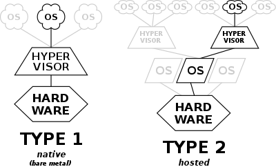
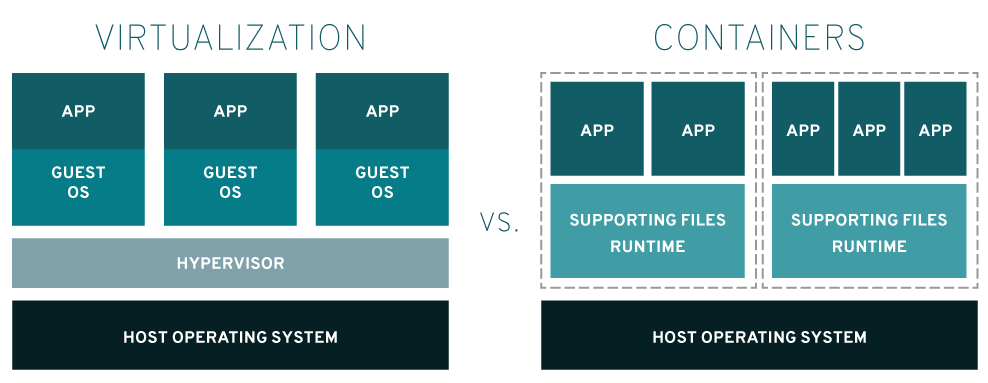
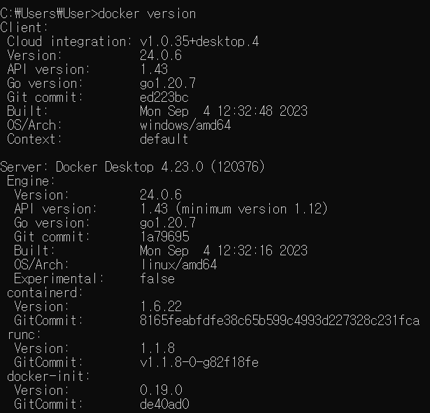

# Docker
도커는 `컨테이너`를 사용해서 `응용 프로그램을 더 쉽게 만들고 배포하고 실행`할 수 있도록 설계된 도구.  
컨테이너 기반의 오픈소스 가상화 플랫폼이면서 생태계.

## 컨테이너?
일상 생활에서 컨테이너는 여러 물건을 실어 옮기는 데에 사용합니다. 서버에서의 컨테이너도 같은 의미를 같습니다.

`서버에서의 컨테이너는 다양한 프로그램과 실행 환경을 컨테이너로 추상화하고, 동일한 인터페이스를 제공해서 프로그램의 배포와 관리를 단순하게 해줍니다.`

AWS, Azure, Google Cloud 등 어디에서든 실행 가능하게 해줍니다.

# Docker를 사용하면..
> 프로그램 다운로드 과정이 간단해진다!

일반적인 다운로드를 생각해볼까요?  
Installer를 설치합니다. 설치된 Installer를 실행시키고 일련의 과정을 따라가다보면 설치가 됩니다.

하지만 짜잔- 항상 설치가 잘 되는 것은 아닙니다. 
운영체제나 버전에 따라서 문제가 생기기도 하죠.

도커로 설치를 한다면, 예상치 못한 에러가 덜 발생하고 설치 과정도 간단합니다. 
`docker run -it redis` 만 친다면 레디스를 다운받을 수 있어요.

# 컨테이너와 가상화의 차이
## 가상화 기술이 나오기 전..
* 한 대의 서버를 하나의 용도로만 사용한다.
* 서버의 남는 공간은 그대로 방치.
* 하나의 서버에 하나의 운영체제, 하나의 프로그램.  
안정적이지만 비효율적!

## Hypervisor 기반의 가상화
* 호스트 시스템에 다수의 게스트 OS를 구동.
* Hypervisor(하이퍼 바이저)는 하드웨어와 각각의 OS를 모니터링하는 중간관리자. 
VM과 하드웨어 사이의 인터페이스 역할을 하고, 물리적 자원에 대한 접근을 할 수 있음.
* 하나의 하드웨어에 여러 다른 종류의 OS를 구동하는 것이 목적.
* Hypervisor는 호스트 OS 위에서 구동이 되는지, 하드웨어에 바로 설치를 하는지에 따라 종류가 나뉜다. Type 1(BareMetal), Type 2(Hosted)

 
※ 출처 : https://en.wikipedia.org/wiki/Hypervisor
### Type 1 (bare-metal, Native)
* 호스트 OS를 대신하고 하드웨어에서 바로 실행이 되어, CPU, memory, storage와 직접적으로 상호작용한다.
* 자원과 직접적으로 접근할 수 있기 때문에, 효율이 높다.
* VM을 관리하고 하드웨어를 제어하기 위해 별도의 관리 시스템이 필요한 경우가 많다.

### Type 2 (Hosted)
* 하드웨어에서 직접 실행되지 않고, 호스트 OS 위에서 구동된다.
* 여러 운영체제를 실행해야 하는 개별 PC 사용자의 경우에 적합하다.
* 호스트 OS를 통해서 자원에 접근해야하기 때문에 성능에 영향이 있다.
또 호스트 OS의 문제가 전파가 된다.
* 자주 사용하는 형태

Hypervisor 기반이라면 각 VM은 독립된 가상 하드웨어 자원을 할당받아 사용하기 때문에, 한 VM에서 발생한 오류가 다른 VM으로 퍼지지 않는다는 장점이 있다.

> ❔ 베어 메탈 
하드웨어 상에 어떤 SW도 설치되어 있지 않는 상태를 뜻한다. 
클라우드에서 베어 메탈 서버는 가상화를 위한 하이퍼바이저 OS 없이 물리 서버를 그대로 제공하는 것을 뜻한다.

 
※ 출처 : https://www.redhat.com/ko/topics/containers/containers-vs-vms

## Container
* 게스트 OS가 필요하지 않으므로, 더 가볍다.
* 컨테이너 방식에서는 애플리케이션을 실행할 때, 애플리케잉션의 실행 패키지인 이미지를 배포하기만 하면된다. 
가상화 방식에서는 VM을 띄우고 자원을 할당하고, 어플리케이션을 실행해야 하기 때문에 조금 더 복잡하고 무겁게 실행한다.
* 동일한 커널을 이용한다.

 

# 도커는 컨테이너를 어떻게 격리할 수 있나요?
리눅스의 `cgroups`, `namesapces` 기능을 사용.
위 두개는 프로세스 사이에 벽을 만드는 리눅스 커널 기능입니다.

## cgroups
* control groups의 약자
* 프로세스들의 CPU, 메모리, 네트워크 대역폭, 디스크 입출력 등의 시스템 리소스 사용량을 관리/제한 및 격리시키는 리눅스 커널 기능.

## namespaces
* 하나의 시스템에서 프로세스를 격리시킬 수 있는 가상화 기술
* 격리된 환경을 제공하는 경량 프로세스 가상화 기술

## 도커가 어떻게 리눅스 명령어를 사용할 수 있죠?
`docker --version`

OS 위에 리눅스 VM 돌아가고 있기 떄문이다. 
Server의 OS를 보면 linux인 것이 보이지요?

> ❔ 커널 
OS의 핵심 요소로, 하드웨어와 프로세스를 잇는 인터페이스. 
메모리나 프로세스를 관리합니다. 메모리에 상주하면서 CPU에 명령을 내립니다.

# RERFERENCE
* Red Hat - 컨테이너와 VM 비교 
https://www.redhat.com/ko/topics/containers/containers-vs-vms
* Baeldung - Virtualization vs Containerization 
https://www.baeldung.com/cs/virtualization-vs-containerization
* IBM - Whar are hypervisors? 
https://www.ibm.com/topics/hypervisors
* Red Hat - What is the linux kernel 
https://www.redhat.com/ko/topics/linux/what-is-the-linux-kernel
* gabia - 베어메탈 서버란? 
https://library.gabia.com/contents/infrahosting/9300/