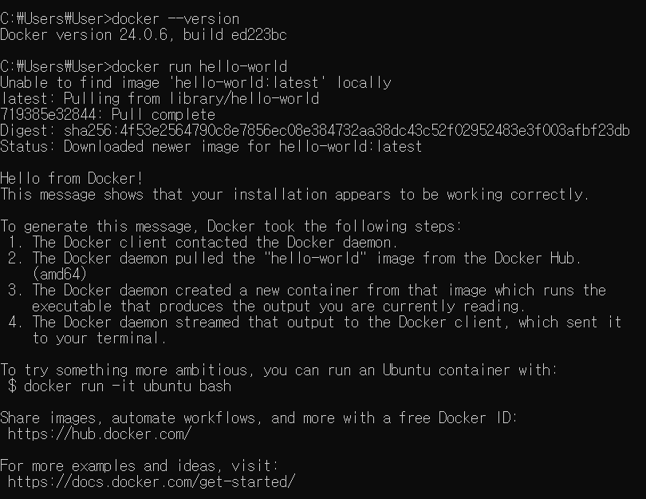
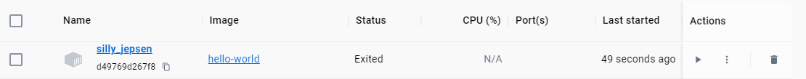

* 도커 Client (CLI) 에 명령어를 입력하면 Docker Server(Daemon) 에서 일을 처리한다.

# docker run!
`docker run hello-world` 으로 hello-world 이미지를 실행시켜보자.  
`docker run <image>`

도커 클라이언트에 위 명령어를 입력하면, Docker 서버는 우선 Cache 보관 장소에 hello-world라는 이미지를 찾고 없다면 `docker hub`에서 이미지를 찾습니다.

# REFERECNE
* docker docs - Docker overveiw 
https://docs.docker.com/get-started/overview/#docker-architecture