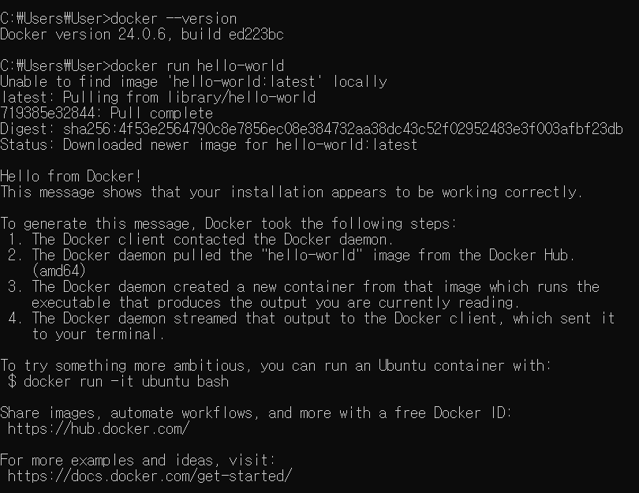
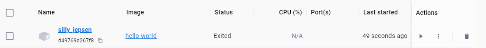

도커 Client (CLI) 에 명령어를 입력하면 Docker Server(Daemon) 에서 일을 처리한다.

`docker run hello-world`
도커 클라이언트에 위 명령어를 입력하면, Docker 서버가 
hello-world라는 이미지를 Cache 보관 장소에서 찾은 후에, 없다면 docker hub에 이미지를 찾아옵니다.
docker hub에는 여러 이미지들이 있습니다.

