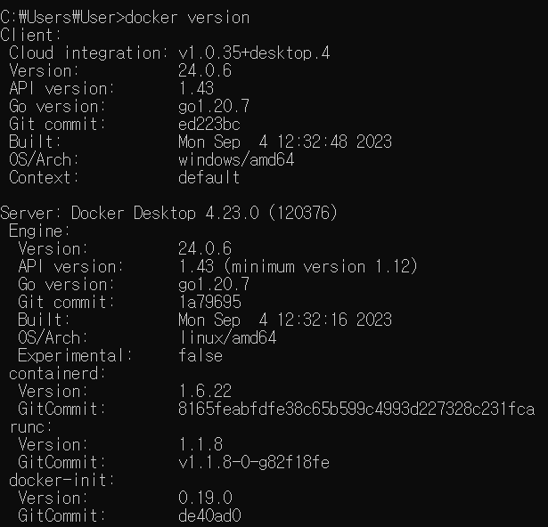

도커에서 어떻게 Cgroup, namespace를 사용할 수 있는 걸까?
namespace는 파일시스템을 나누는거?
cgroup은 좀더 하드웨어적인걸 관리하는거. 

이거 두개는 리눅스 환경에서 사용할 수 있죠?
어떻게?

`docker --version`
도커의 OS가 linux래! 

그 이유가 OS 위에 리눅스 VM위에서 돌아가고 있기 떄문이다.
커널은 뭘까?