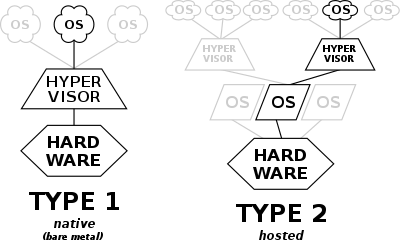
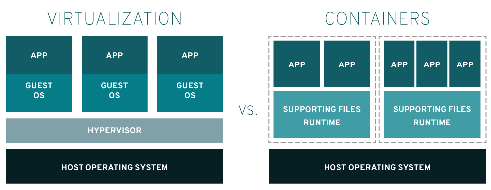

# 요약

# 컨테이너 플랫폼
- 컨테이너를 동작시키기 위한 컨테이너 플랫폼.
- 컨테이너 플랫폼으로 Docker, Rocket 있음
    - See also. [Red Hat - Rkt](https://www.redhat.com/en/topics/containers/what-is-rkt)
- Docker 를 설치하고 Docker Daemon 을 실행하면, 플랫폼이 만들어짐.
그때부터 컨테이너 빌드/실행 가능
- 컨테이너를 저장하는 창고를 `hub` 라고 하고, private 한 것은 docker registry.
    - hub 에서 컨테이너를 push/pull  가능.

```
docker create --name app -p 80:8080 [name]
docker start app
docker exec -it app sh # bash
```

-p 80:8080 : 80 port 로 들어오면 8080로 포워딩.
호스트네임을 출력하도록 하면?


# 가상 머신 VS 컨테이너
## 가상 머신
* Hypervisor 기반의 가상화. 
    * Hypervisor 로는 Vmware, VirtualBox 있음.
* Hypervisor 사용해서 가상 머신을 만든다. 가상 머신안에는 Guest OS 와 APP. 
    * 가상 머신 별로 필요한 하드웨어 자원을 다르게 줘서 효율적으로 운영할 수 있음.
    * scale out 을 한다면, App 뿐만 아니라 Guest OS 만큼 늘어남.
* Hypervisor는 호스트 OS 위에서 구동이 되는지, 하드웨어에 바로 설치를 하는지에 따라 종류가 나뉜다. Type 1(BareMetal), Type 2(Hosted)

</br>
※ 출처 : https://en.wikipedia.org/wiki/Hypervisor

## 컨테이너
- 컨테이너 환경은 인프라(하드웨어) 위에 OS 가 설치되어 있고, 그 위에 도커가 올라간다. 그리고 그 위에서 어플리케이션을 동작시킨다.
- 컨테이너는 소스코드와 베이스 환경만 알면되어서 컨테이너가 가상머신에 비해 가몁다. `빠른 확장/축소/배포` 가능.

</br>
※ 출처 : https://www.redhat.com/ko/topics/containers/containers-vs-vms

# 멀티호스트 도커 플랫폼
- 플랫폼 역할을 하는 서버의 다운을 생각했을 때, 서버 하나만을 컨테이너 플랫폼으로 하기보다, 여러 서버를 컨테이너 플랫폼으로 해야한다.
    - 도커 1 : A서버1, A서버1
    - 도커 2 : A서버2
- 만약 도커 1 서버가 다운 되었을 떄, 도커 2로 요청이 가도록 해야한다.
- 컨테이너에 대한 운영이 필요한 것. => `컨테이너 오케스트레이션`
    - 어플리케이션을 잘 배치해서 잘 운영되도록 하는 것.

# Kubernetes
- kubernetes.io 
- 자동 배포/스케일링/관리
- 그리스어로 `조타수` 라는 뜻.
- 구글이 CNCF 재단 설립하고, 그 재단에 쿠버네티스 기부.
    - CNCF : Cloud Native Computing Foundation
    - 프로메테우스도 관리하고, k8s 자격증도 지원함.

### 특징
- 워크로드 분리
    - 컨테이너는 분리하지만, 컨테이너간 통신은 잘 됨.
- 어디서나 실행가능 
    - 어디서든 설치해서 실행할 수 있음. AKS, EKS, GKE 같은 퍼블릭 클라우드에 설정 파일만으로 동일하게 실행할 수 있음.
- 선언적 API 
    - 1웹서버 3개 요청한다!(선언임)`
    - 다른거는 어떻길래?