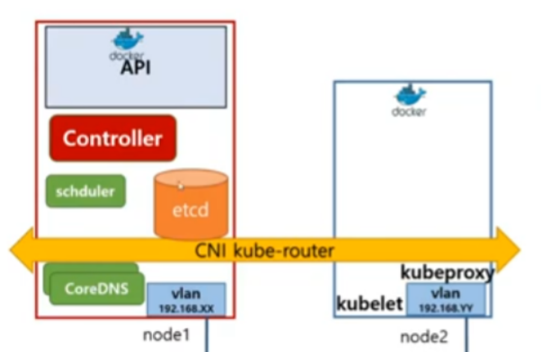

```
👉 K8S 환경을 설치하지 않고 실습할 수 있는 playground
👉 컨테이너간 통신을 위한 "CNI"
```

# 실습 환경 설정
## 웹 실습
- K8S 환경을 설치하지 않고, 웹에서 실습할 수 있음.
- K8S Playground : https://labs.play-with-k8s.com/
  - 4시간 사용 가능
- (Closed) Katacoda : https://katacoda.com/courses/kubernetes/


- 웹 환경에서는 위와 같은 컴포넌트로 구성 됨.

## CNI
- Container Network Interface
- 컨테이너간 통신을 지원하는 VxLan. Pod Network 라고도 함.
- 컨테이너간 통신을 위해서 CNI 플러그인이 필요함.
  - Kubernetes Network Model 을 구현하기 위해 필요.
  - https://kubernetes.io/docs/concepts/services-networking/#the-kubernetes-network-model
  - 플라넬(Flannel), 칼리코(Calico), 위브넷(Weave Net) 을 사용할 수 있음.
    - https://kubernetes.io/docs/concepts/cluster-administration/addons/#networking-and-network-policy 에서 addon 확인할 수 있음.
- 컨네이너 <-> CNI <-> 물리 네트워크 <-> CNI <-> 컨테이너

```
✔ VxLan
- Virtual eXtention LAN (가상의 확장가능한 Local Area Network)
- IETF(Internet Engineering Task Force)에서 만든 네트워크 가상화 기술 표준
```