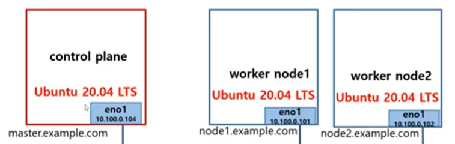
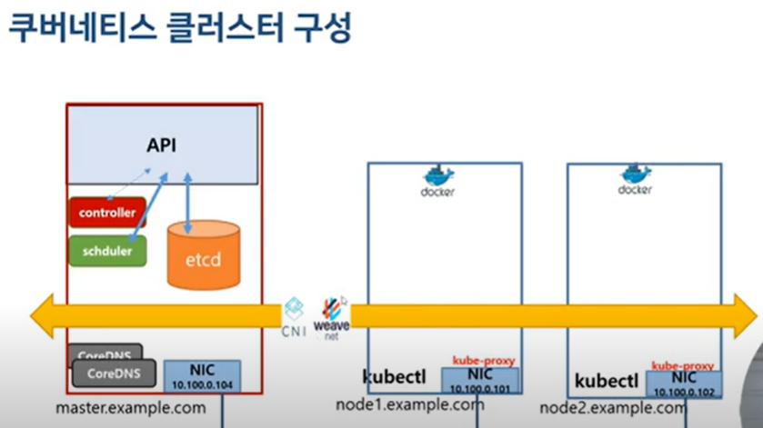

# 요약
- K8S 환경을 직접 설치하는 방법
- Master Node, Worker Node

# 실습 환경 설정
- 직접 설치하여 실습 환경 설정
- Docker 설치 > K8S 설치

## Tools
- https://kubernetes.io/docs/setup/production-environment/tools/

### kubeadm
- k8s 에서 공식으로 제공하는 클러스터 생성/관리 도구

### kubespray 
- 오픈소스 프로젝트
- 다양한 형식으로 k8s 클러스터 구성 가능
- 다양한 CNI 제공

## 클러스터 구성

- control plane (master node)
  - 워커노드 상태 관리 및 제어
  - single master 도 되고, 3 or 5 개의 master node 가능.
    - multi 는 어떻게?

- worker node 
  - 실제 컨테이너를 동작하여 서비스 제공.

```
✔ plane
- 네트워킹에서 특정 프로세스가 발생하는 위치에 대한 추상적인 개념으로 이해
- 영역정도로 이해하면 될 것 같음.
- control/management/data plane ...
```

```
✔ Ubuntu
Interim, LTS(Long Term Support) 타입의 release 있음.
- Interim : 9개월 간 지원
- LTS : 5년 표준 보안 관리 + 
   - 짝수년도의 (2년마다) 4월 마다 LTS 버전이 나옴.

- https://ubuntu.com/about/release-cycle
```

# Docker 설치
- https://docs.docker.com/
- Repository 를 사용해서 다운하는 방법은 아래 링크의 가이드 참고.
  - https://docs.docker.com/engine/install/ubuntu/#install-using-the-repository

## Snippet
- `sudo apt-get install ca-certificates curl`
- `sudo install -m 0755 -d /etc/apt/keyrings`
- `sudo curl -fsSL https://download.docker.com/linux/ubuntu/gpg -o /etc/apt/keyrings/docker.asc`
- `sudo chmod a+r /etc/apt/keyrings/docker.asc`


- `echo \
  "deb [arch=$(dpkg --print-architecture) signed-by=/etc/apt/keyrings/docker.asc] https://download.docker.com/linux/ubuntu \
  $(. /etc/os-release && echo "$VERSION_CODENAME") stable" | \
  sudo tee /etc/apt/sources.list.d/docker.list > /dev/null`

- `sudo apt-get update`
-  `sudo apt-get install docker-ce docker-ce-cli containerd.io docker-buildx-plugin docker-compose-plugin`

## 상세
- docker.asc
```
-----BEGIN PGP PUBLIC KEY BLOCK-----

-----END PGP PUBLIC KEY BLOCK-----
```

# K8S 설치
- https://kubernetes.io/
  - kubeadm 설치 : https://kubernetes.io/docs/setup/production-environment/tools/kubeadm/install-kubeadm/ 

## swap off
- `swapoff -a && sed -i '/swap/s/^/#/' /etc/fstab`
  - swapoff : 재부팅 시 초기화됨.

```
✔ swap
- 메모리가 가득찼을 때, 디스크 일부 공간을 메모리 처럼 사용.
- 실제 메모리보다 속도 느림.
```

## Snippet
- `sudo apt-get install -y apt-transport-https ca-certificates curl gpg`
- `curl -fsSL https://pkgs.k8s.io/core:/stable:/v1.32/deb/Release.key | sudo gpg --dearmor -o /etc/apt/keyrings/kubernetes-apt-keyring.gpg`
- `echo 'deb [signed-by=/etc/apt/keyrings/kubernetes-apt-keyring.gpg] https://pkgs.k8s.io/core:/stable:/v1.32/deb/ /' | sudo tee /etc/apt/sources.list.d/kubernetes.list`
- `sudo apt-get update`
- `sudo apt-get install -y kubelet kubeadm kubectl`
- `sudo apt-mark hold kubelet kubeadm kubectl`

## 상세
- **kubeadm** : 클러스트를 bootstrap 하는 명령어.
- **kubelet** : 파드나 컨테이너 시작과 같은 작업을 수행하는 명령어. (마스터와 통신할 때 사용)
- **kubectl** : 클러스너에 명령하기 위한 명령어.

## control plane, worker node 설정
### Snippet
- (control) `kubeadm init`
- (control) `mkdir -p $HOME/.kube`
- (control) `sudo cp -i /etc/kubernetes/admin.conf $HOME/.kube/config`
- (control) `sudo chown $(id -u):$(id -g) $HOME/.kube/config`
- (control) `kubectl apply -f https://github.com/weaveworks/weave/releases/download/v2.8.1/weave-daemonset-k8s.yaml` :: yaml 은 변경가능
- (worker) `kubeadm join ...`
## 상세
- `kubeadm init` 성공 시 아래 로그 확인 가능.
- `mkdir ...` 부분 실행
- `kubeadm join ...` 부분을 worker node 에서 실행
```
Your Kubernetes control-plane has initialized successfully!

To start using your cluster, you need to run the following as a regular user:

  mkdir -p $HOME/.kube
  sudo cp -i /etc/kubernetes/admin.conf $HOME/.kube/config
  sudo chown $(id -u):$(id -g) $HOME/.kube/config

Alternatively, if you are the root user, you can run:

  export KUBECONFIG=/etc/kubernetes/admin.conf

You should now deploy a pod network to the cluster.
Run "kubectl apply -f [podnetwork].yaml" with one of the options listed at:
  https://kubernetes.io/docs/concepts/cluster-administration/addons/

Then you can join any number of worker nodes by running the following on each as root:

kubeadm join ...

```
- kubectl apply -f https://github.com/weaveworks/weave/releases/download/v2.8.1/weave-daemonset-k8s.yaml
  - 사용하는 CNI 에 따라서 -f 옵션 뒤 값을 변경.


## auto completion
- https://kubernetes.io/docs/reference/kubectl/generated/kubectl_completion/

```
source <(kubectl completion bash)
echo "source <(kubectl completion bash)" >> ~/.bashrc
```


## TroubleShooting
### worker node에서 join 명령어 실행 시
```
error execution phase preflight: [preflight] Some fatal errors occurred:
        [ERROR FileAvailable--etc-kubernetes-kubelet.conf]: /etc/kubernetes/kubelet.conf already exists
        [ERROR FileAvailable--etc-kubernetes-pki-ca.crt]: /etc/kubernetes/pki/ca.crt already exists
```
- 로그에서 이미 존재한다고 나와있어서 파일 삭제함.
  - rm /etc/containerd/config.toml
  - rm /etc/pki/ca.crt
  - systemctl restart containerd

# TODO

NIC : Network Interface Card
