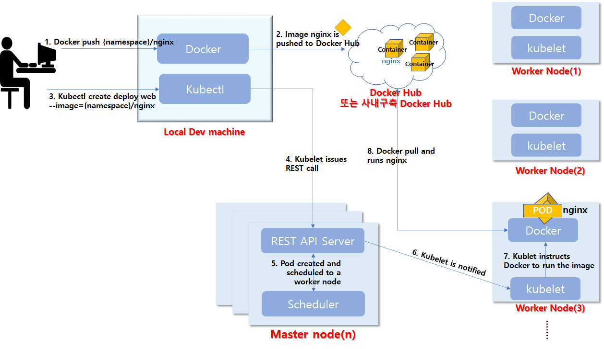
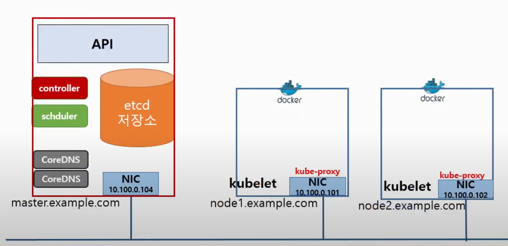

```
👉 마스터 컴포넌트, 워커 노트 컴포넌트
```

# 쿠버네티스에서 컨테이너의 동작 흐름

- https://rection34.tistory.com/132

`Scheduler` 노드 상태를 확인하고 컨테이너를 실행할 노드를 선택.</br>
`Api Server` 선택된 노드에 kubelet 에 요청.</br>
`kubelet` 이 요청을 도커 요청으로 바꿔서 Docker Daemon 에 실행 요청
쿠버네티스는 동작되는 컨테이너를 파드라는 단위로 관리.

# 컴포넌트
## 마스터 컴포넌트
클러스터에 관한 전반적인 결정(스케줄링 등)을 수행. </br>
클러스터 이벤트(❓ 디플로이먼트의 replicas 필드에 대한 요구 조건이 충족되지 않을 경우 새로운 파드를 구동시키는 것)를 감지하고 반응

| 이름 | 설명 |
| -- | -- |
| etcd | ❓ 일관성·고가용성 key-value 타입의 저장소로, 쿠버네티스에 관한 정보를 저장</br> 워커 노드들에 대한 상태 정보, 리소스 사용 정보, 컨테이너 혹은 이미지의 상태 등을 저장함|
| kube-apiserver | k8s API를 사용하도록 요청을 받고 요청이 유효한지 검사 |
| kube-scheduler | 파드를 실행할 노드 선택 </br> 결정 요소로 리소스에 요구 사항, 하드웨어/소프트웨어/정책적 제약, ❓ 어피니티(affinity) 및 안티-어피니티(anti-affinity) 명세, 데이터 지역성, 워크로드간 간섭, 데드라인 포함|
| kube-controller-manager | 파드를 관찰하며 개수를 보장 </br> 노드 컨트롤러 : 노드가 다운 되었을 때 대응 </br> 잡 컨트롤러 : 일회성 작업을 나타내는 잡 오브젝트 감시, 해당 작업을 완료할 때까지 동작하는 파드 생성. </br> 엔드포인트 슬라이스 컨트롤러 : ❓ </br> 서비스 어카운트 컨트롤러 : 새로운 네임스페이스에 대한 기본 서비스 어카운트❓ 생성|
| cloud-controller-manager |  |

```
✔ etcd
유닉스에서 구성 데이터를 저장하는 /etc 폴더와 distributed system 의 d 와 합쳐진 말.
분산된 시스템에 대한 구성 데이터를 저장한다.
```

## 워커 노드 컴포넌트
| 이름 | 설명 |
| -- | -- |
| kubelet | 각 노드에서 실행되는 k8s 에이전트 </br> 데몬 형태로 동작 </br> PodSpec을 받아, 컨테이너가 스펙에 따라 건강하게 동작하는 것 보장 </br> cAdvisor 라는 모니터링 툴이 포함. </br> 워커노드의 정보를 수집해서 마스터에 전달. 이 내용은 etcd 에 저장됨. |
| kube-proxy | k8s의 network 동작을 관리 </br> iptables rule 구성 |
| 컨테이너 런타임 | 컨테이너를 실행하는 엔진 </br> docker, containerd, runc |



```
✔ 데몬 (daemon)
- 사용자가 직접 제어하지 않고 백그라운드에서 실행되는 프로그램

✔ iptables
- 리눅스에서 트래픽을 관리하기 위한 방화벽 설정 도구

✔ NIC (Network Interface Card)
- 컴퓨터를 네트워크에 연결하여 통신하기 위해 사용하는 하드웨어 장치
```

### 흐름
1. 사용자가 kubectl 명령어로 요청 
2. Master 의 API 컴포넌트가 요청의 문법, 권한 등 검사
3. 요청이 합당할 때, 요청 실행
4. API -> etcd 저장소에서 노드 정보 확인
5. scheduler 에서 실행할 노드 선택(응답)
6. 위 정보로 특정 노드의 kubelet 에 요청
7. kubelet 은 요청 내용을 도커 명령어로 변환하여 도커로 요청
8. 도커가 명령 실행
</br>
- 컨트롤러 : 노드가 죽었을 때, API 에 요청. 4~8 작업 진행
- coreDNS 와 컨테이너간에 통신을 지원하는 네트워크 애드온 프로그램으로 CNI 는 우리가 추가적으로 설치할 수 있는 애드온.

## 애드온
### 네트워크 애드온
- CNI - weave, calico, flannel, kube-route

### DNS 애드온
- coreDNS

### 대쉬보드 애드온
### 컨테이너 자원 모니터링
- cAdvisor
### 클러스터 로깅
- 컨테이너 로그, k8s 운영 로그들을 수집해서 중앙화
- ELK(ELasticSearch, Logstash, Kibana), 
EFk(ES, Fluentd, Kibana), DataDog

# TODO
- 마스터 컴포넌트와 워커 노드 컴포넌트, 설치는? 포함?
- multi master 인 경우 etcd 는 관리?