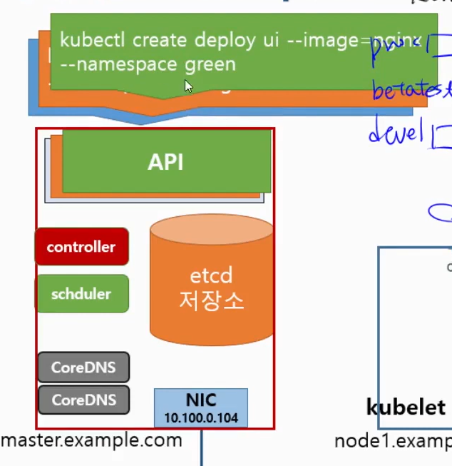
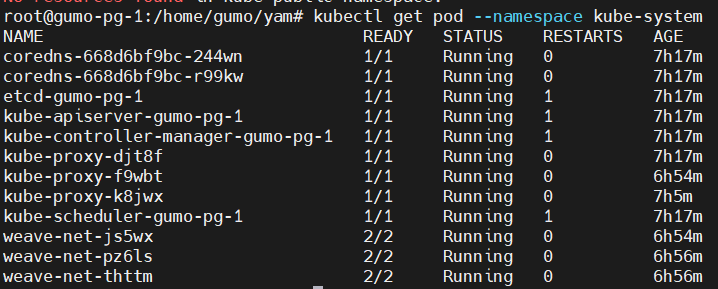

# 요약

# namespace
- K8S API 종류 중 하나
- 클러스터 하나를 여러 개의 논리적이 단위로 나눠서 사용
- 쿠버네티스 클러스터 하나를 여러 팀이나 사용자가 함께 공유
- 용도에 따라 실행해야 하는 앱을 구분할 때 사용.

쿠버는 하나죠. 근데 api 기준으로 해서 마치 이런 클러스터가 여러개 있는 것처럼 만들어지는거다.

kubectl create namespace 
이렇게하면 쿠버는 하나인데 namespace 는 여러개
- A ns : API, Pod, Service, Persistence Volume..
- B ns : "

왜 하나?
- A 기업에서 a, b, c 사업을 하는거면 각 각의 사업에서 다른 ns 를 쓰면 되는거죠.

장비는 하나지만.. 시스템을 따로 두어 논리적으로 나누는게 ns다.
근데 내부에서 환경별로 나눠질 수도 있따.

beta 용 등등.
물리적으로 하나지만 논리적으로 여러개로 나눠서 동작시키는 것.


좋은점?
- 분류가 된다. 논리적 격리? 관리 용이.
- 환경별 관리 가능.



# 사용
## 생성

CLI
- `kubectl create namespace [name]`
- `kubectl get namespaces`  
yaml
- `kubectl create namespace [name] --dry-run -o yaml > [file name].yaml`
- `kubectl create -f [file name].yaml`


## 기본 namespace
- default
- kube-node-lease
- kube-public
- kube-system

default : 기본적으로 생성된거는 여기에 들감.
kube 로 시작하는거는 쿠버네티스 운영을 위한 namespace



`kubectl get pods --all-namespaces`
`kubectl create -f test-server.yaml --namespace beta`

### yaml
```
metadata:
  labels:
    run: test-server
  name: test-server
  namespace : beta
```

namespace 를 지정하지 않으면 default namespace 
이걸 바꾸려면?

### namespace switch
namespace 를 포함한 context 등록
- config 에 ns 를 등록. 등록한 공간을 k8s config 의 context 라고 함.
```
kubectl config --help
kubectl config set-context [name] --cluster=kubernetes --user=kubernetes-admin --namespace=beta
kubectl config view
```

등록된 namespace 로 context 변경
- `kubectl config use-context [name]`

- namespace 를 삭제하면, 안에 속한 것들이 다 삭제 됨.
- config 내용은 그대로

```
:se nu
```