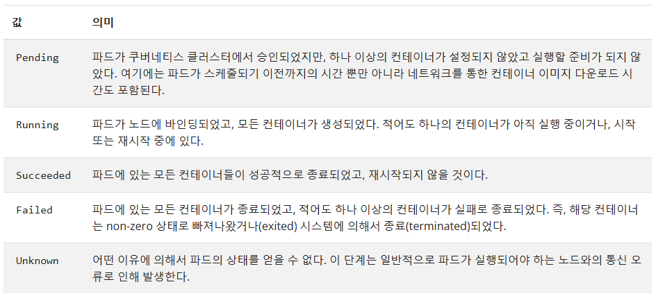
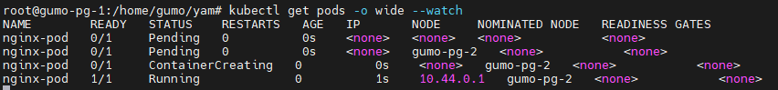
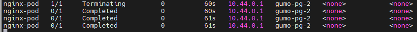

# Pod 동작 flow
- Pending : pod 를 실행하기 전 노드가 선택되는 과정까지(스케줄링)
- Running : 배치 받음.
- Succeeded / Failed



```bash
# pod 상태가 변경있을 때 계속 출력됨.
kubectl get pods -o wide --watch

# 모든 namespace 에 대한 pod 목록
kubecl get pods --all-namespaces
```

### 생성


### 삭제


```bash
 kubectl get pods | grep Running | wc -l
 # wc -l : 라인 수
```