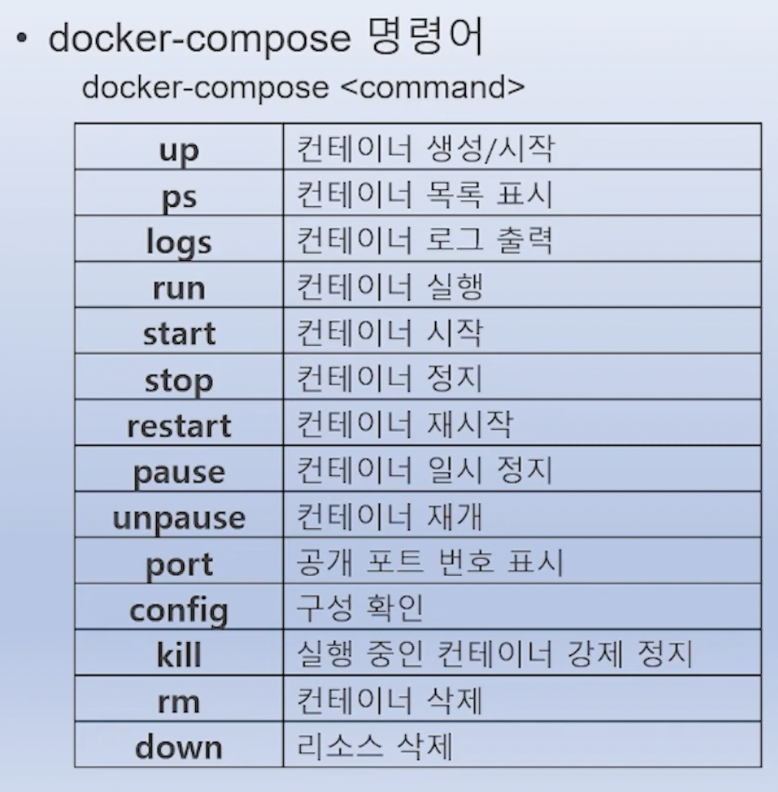

# Docker Compose
- 여러 컨테이너를 일괄적으로 정의하고 실행할 수 있는 틀
- yaml 파일로 작성
- 외부 접속 하지 않는 컨테이너는 scale out/in 가능.

## 주요 키워드
키워드 | 설명 | 예시
---- | ---- | ---- |
version | Compose 파일의 버전 지정. 버전 따라 지원 문법 다름. | "3.9"
services | 실행할 컨테이너(서비스)들을 정의 | web, db
image | 사용할 Docker 이미지 지정 | nginx:latest
build | Dockerfile을 통해 이미지 직접 빌드 | build: .
container_name | 컨테이너 이름 지정 | "my-app-container"
ports| 호스트 ↔ 컨테이너 포트 매핑 | "8080:80"
environment | 환경 변수 설정 | - NODE_ENV=production
volumes | 볼륨 마운트 (데이터 유지용) | ./app:/usr/src/app


## 예시
```yaml
version: "3.9"  # (선택적) Compose 파일 버전
services:
  {서비스이름}:
    image: {이미지이름[:태그]}
    build:
      context: .
      dockerfile: Dockerfile
    container_name: {컨테이너이름}
    ports:
      - {"호스트포트:컨테이너포트"}
    environment:
      - KEY=value
      - ANOTHER_KEY=value
    volumes:
      - {호스트경로:컨테이너경로}
    networks:
      - {네트워크이름}
    depends_on:
      - {다른서비스이름}
    restart: always
    command: ["실행할", "명령어"]
    entrypoint: ["엔트리포인트", "명령어"]
    working_dir: /app
    user: "1000:1000"
    tty: true
    stdin_open: true
networks:
  {네트워크이름}:
    driver: bridge
volumes:
  {볼륨이름}:
    driver: local
```

# docker-compose 주요 명령어
