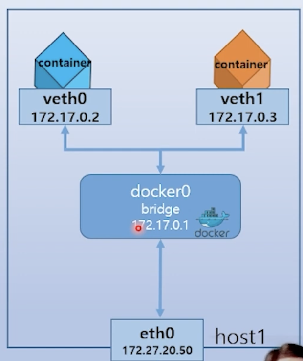

# 컨테이너 통신


- docker0 는 스트 네트워크와 컨테이너 네트워크를 연결하는 브릿지.
- iptables 를 이용하여 내부적으로 NAT 서비스와 포트 포워딩 기능을 지원
- L2 통신 기반
- container 생성 시 veth 인터페이스 생성
- 모든 컨테이너는 외부 통신을 docker0 를 통해 진행.
- 컨테이너는 172.17.x.x 가상 IP 할당 받음.

```sh
# 출력되는 것은 물리/가상 NIC 목록.
ifconfig
```

# 컨테이너 포드 외부 노출
- `port forwarding` 으로 컨테이너 포트를 외부로 노출시켜 외부 연결을 허용할 수 있음.
- `iptables rule` 을 통해 포트 노출

```sh
# host 의 80 포트의 연결을 컨테이너의 8080 포트로 포워딩
docker run -d -p 80:8080 [image\]
```

# 컨테이너 네트워크 추가
- docker0 인터페이스 내에서는 static IP 할당 불가.

### user defined network 생성
```sh
docker network create ...
```