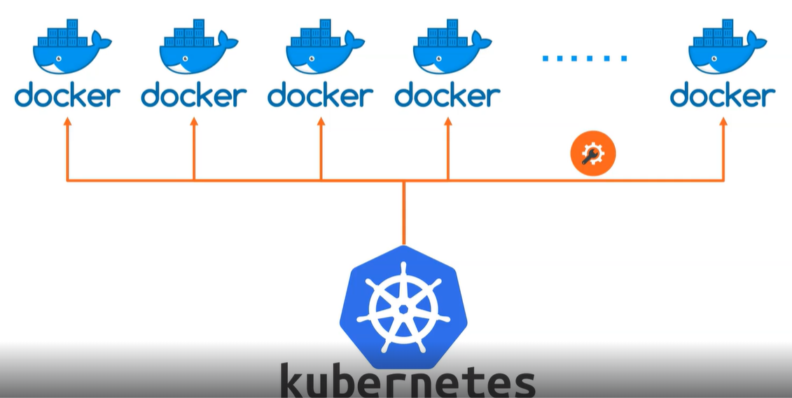
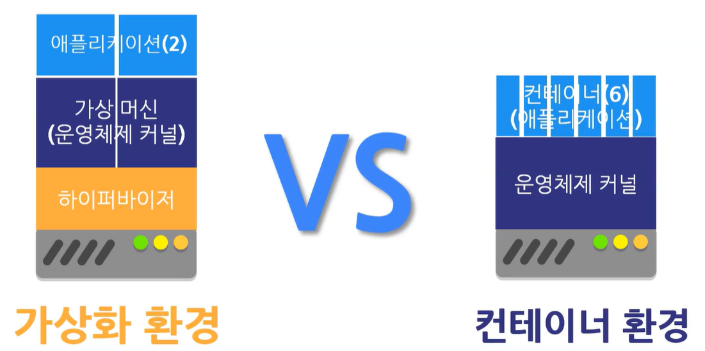

쿠버네티스는 컨테이너를 관리한다.
Ochestration 이라고 말을 한다.

# 도커는 뭘까?
가상화 환경과 주로 비교를 한다.
가상화 환경에 비해 더 많은 어플리케이션을 올릴 수 있음.

# 쿠버네티스는 누가 만들었을까?
구글의 Borg 시스템이 있었는데, 이 시스템을 CNCF에 기부했고
CNCF가 관리함. 
벤더에 종속 (vendor neutral)
쿠버네티스도 리눅스처럼 다양한 배포판이 있다.

# 쿠버네티스의 배포 종류
## 관리형 쿠버네티스
aws, azure, CCP
## 설치형 쿠버네티스
Rancher, openshift
배포할 수 있는 하나의 패키지
## 구성형 쿠버네티스
원하는 형태로 자유롭게 구성할 수 있음.
kubeadm, kops, kubesprary, krib
