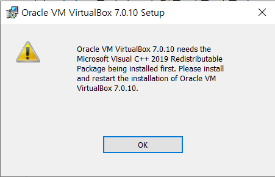
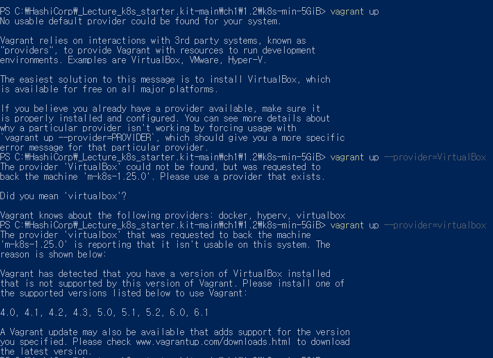
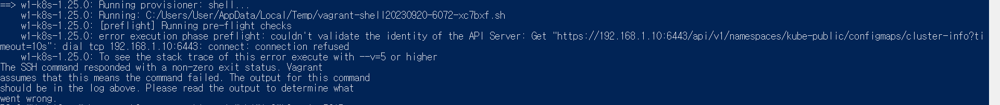
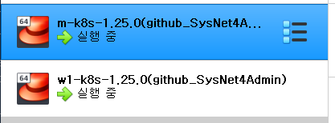

플레이 쿠버네티스나, 쿠버네티스 플레이그라운드처럼 교육용으로 사용할 수 있는 웹에서 제공하는 쿠버네티스 환경이 있으나...
제한이 있다!

일단 웹에서 하다보니.. 세션 저장에 대한 불편함.
플레이 쿠버네티스는 4시간 제한이 있고,
쿠버네티스 플레이그라운드는 노드가 제한적이다.
자유로운 사용이 불가능하다.

# 그러면 어떻게 설정할까요?
vagrant 라는 hashiCorp에서 만든 도구가 있다!
버추얼 박스라는 가상 머신을 관리하는 도구에 vagrant를 사용해서 코드를 보내면, 노드가 올라오게 된다.
이렇게하면 어디서든 쿠버네티스 노드를 사용할 수 있게 된다.

버추얼박스에 centOs를 설치하고 노드를 올리는?
버추얼 박스는 저 centOS 가상 머신을 관리.

주로 vmware를 사용하긴하는데, vagrant랑 궁합이 좀 안맞다.

> 베어메탈, hashicorp

putty만 사용하면 다수의 세션 접속이 어려워서 Supeer Putty를 사용.
