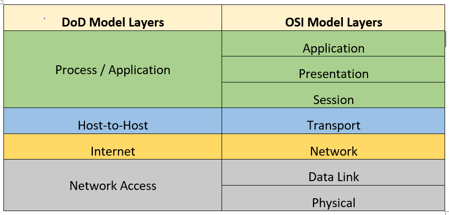

# OSI 7 Layer 와 식별자
### 계층별 대표적인 프로토콜
- 1계층 : 물리 계층은 이 강의에서 다루지 않음.
- 2계층 : 유선 네트워크 = Ethernet
- 3계층 : Internet
- 4계층 : TCP/UDP
- 5계층 : SSL(TLS)
- 6계층 : 
- 7계층 : HTTP

HTTP + SSL = HTTPS

하드웨어 계층은 NIC 가 있고, 그 위에 드라이버가 있음. 그 위에는 프로토콜이 있고. User mode application 에서 는 Chorme 브라우저를 주로 쓴당.

### 식별자
L2 의 식별자는 MAC (Physical address)
Mac 주소는 NIC 를 식별한다.
- NIC 가 3개라면 MAC 주소 3개.

L3 : IP 주소 (여기서는 v4만 다룬다)
- host 에 대해 식별

L4 : Port 번호
- port 는 어떤 것에 대한 식별자인지 분야마다 다름.
- Process, l2 interface, service 일 수 있음.

```
# Windows CMD 기준
ipconfig /all
```

이런 분류 방식이 OSI 7 Layer 만 있는게 아니다.
DoD(Depart of Defense)

