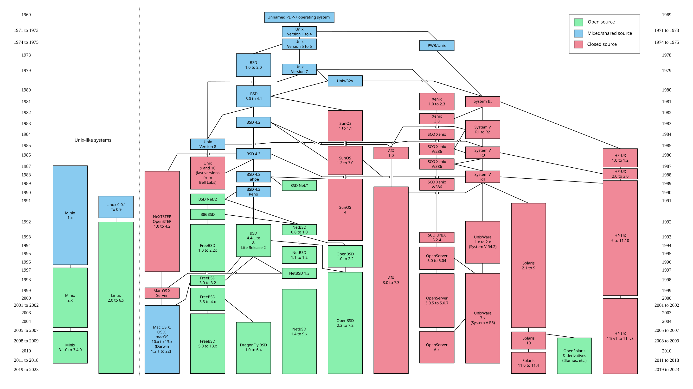

## Feature Test Macro 와 표준안?
### Feature Test Macro
C/C++ 코드에서 어떤 언어 기능, 라이브러리 기능 등이 사용 가능한지 판단하기 위해 사용하는 매크로

```c
#if __has_include(<optional>) && defined(__cpp_lib_optional) && __cpp_lib_optional >= 201603
  #include <optional>
  using std::optional;
#else
```

#### 전처리기
컴파일 하기 전에 실행되는 도구로, `#` 으로 시작하는 지시자를 처리함. (_#include_, _#define_, _#if_)


#### 매크로
`#define` 지시어로 생성됨.

```c
#include <stdio.h>
#define PI 3.14159

int main() {
    printf("%f\n", PI);  // becomes: printf("%f\n", 3.14159);
    return 0;
}
```

### 표준안
새 기능을 도입할 때 작성하는 기능 제안 문서

## Unix
- Multics 부터 Unix 까지
  - Multics : Multiflexed Information and Computing System
  - Unix : UNiplexed Information Computing System
- 어셈블리어로 작성된 유닉스는 이식성과 호솬성이 떨어져 B 언어로부터의 새로운 언어인 C 언어를 이끌내어 C 언어로 포팅함.

## 🤖 Assembly / Fortran / B / C

| 항목           | **어셈블리어**                | **Fortran**                  | **B 언어**                 | **C 언어**                         |
| ------------ | ------------------------ | ---------------------------- | ------------------------ | -------------------------------- |
| **등장 시기**    | 1940\~50년대               | 1957년 (IBM, 존 배커스)           | 1969년 (Bell Labs, 켄 톰슨)  | 1972년 (Bell Labs, 데니스 리치)        |
| **개발 목적**    | 기계어를 사람이 읽기 쉽게 하기 위해     | 수치 해석, 과학 계산용                | BCPL을 간소화하여 UNIX 구현용     | UNIX 시스템 개발, B의 개선               |
| **언어 수준**    | 매우 저수준                   | 고수준                          | 중간 수준                    | 중간 수준                            |
| **자료형**      | 없음 (레지스터, 주소 직접 사용)      | `INTEGER`, `REAL` 등 기본형 존재   | 없음 (모든 변수는 word 단위)      | 다양한 자료형 지원 (`int`, `float` 등)    |
| **제어 구조**    | 분기(jump), 조건 분기 등        | `IF`, `DO`, `GOTO`, `CALL` 등 | `if`, `while`, `goto` 등  | `if`, `for`, `while`, `switch` 등 |
| **이식성**      | 매우 낮음 (하드웨어마다 다름)        | 낮음\~보통 (표준은 있지만 구현체 차이 존재)   | 낮음 (PDP 계열 하드웨어에 종속적)    | 높음 (플랫폼별 컴파일러 존재)                |
| **주 사용 분야**  | 임베디드 시스템, OS 부트코드, 펌웨어 등 | 수학/공학 계산, 시뮬레이션              | 초기 UNIX 개발               | 시스템 SW, 임베디드, 응용 SW, OS 등        |
| **장점**       | 하드웨어 직접 제어 가능, 최대 성능     | 수학 계산에 특화, 성숙된 최적화 도구 존재     | 단순한 구조, UNIX 프로토타입 구현 가능 | 빠름, 유연함, 포인터 등 강력한 저수준 기능        |
| **단점**       | 유지 보수 어려움, 이식 불가         | 범용 언어로는 부적합                  | 자료형 없음, 기능 부족            | 메모리 안전성 부족, 실수에 민감               |

### 각 언어로 “두 수를 더하는” 코드 예시
- Assembly (플랫폼마다 다름)
```
section .data
    a dd 5
    b dd 3

section .text
    global _start

_start:
    mov eax, [a]   ; eax = a
    add eax, [b]   ; eax = eax + b

    ; 결과는 eax에 있음
    ; OS에 종료 신호 보냄 (리눅스 기준)
    mov ebx, 0
    mov eax, 1
    int 0x80
```

- Fortran (FORmula TRANslation)
```fortran
PROGRAM AddTwoNumbers
  INTEGER :: a, b, sum

  a = 5
  b = 3
  sum = a + b

  PRINT *, "Sum is", sum
END PROGRAM AddTwoNumbers
```

- B
```c
main() {
  auto a, b, sum;
  a = 5;
  b = 3;
  sum = a + b;
  putn(sum);
}
```

- C
```c
#include <stdio.h>

int main() {
  int a = 5, b = 3;
  int sum = a + b;
  printf("Sum is %d\n", sum);
  return 0;
}
```

## Unix 의 분화
- AT&T 에서 유닉스를 실비 수준으로 배포했고, 여러 방향으로 전직.
  - AT&T 계열 (System V)
  - BSD 계열
- 하지만 전직한 유닉스끼리 포팅하기 어려워지게 됨.
  - 독점 전략으로 다른 회사의 시스템으로 변경하기 어렵게 하기 위해 호환성을 배제하기도 함.
- 소프트웨어에게는 독이 되었음. 다른 벤더의 유닉스에 포팅하려면 비용이 많이 들게 됨.
- **호환성 표준안**의 필요성 대두

## POSIX (Portable Operating System Interface)
- IEEE 에서 유닉스를 표준화하기 시작했고, 1988년에 POSIX 표준안의 초안인 POSIX 1003-1988(IEEE std 1003.1-1988) 이 발표됨.
- 몇 번의 수정 후 1990 년에 ISO(국제 표준화 기구)의 승인을 받음.
  - 승인 받은 표준안을 POSIX.1(POSIX 1003.1-1990)
- POSIX.1(1990) : 구현보다는 외적인 작동만 만족하면됨.
- POSIX.2(1992) : 쉘과 유틸리티에 대해 표준안이 제정됨.
- 1998 년도에 통한된 형태의 SUS(Single UNIX Specification) 표준이 탄생.

