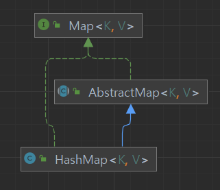

# equlas는 일반 규약을 지켜 재정의하라.
```java
public boolean equals(Object obj) {
        // 같은 대상을 참조하고 있는지
        return (this == obj);
    }
```
위는 자바 모든 클래스의 상위 클래스인 Object 클래스의 equals 메소드다.</br>
재정의하지 않는 경우에는 인스턴스를 자기 자신과 비교할 때만 true를 반환하게 된다.

## 1️⃣ equals를 재정의 하지 말아야 하는 경우

### 1. 각 인스턴스가 본질적으로 고유한 경우
* 값이 아닌, `Thread`클래스 처럼 동작하는 개체를 표현하는 클래스인 경우

### 2. 인스턴스의 논리적 동치성을 검사하지 않는 경우
* String의 경우에는 논리적 동치성을 검사한다.
```java
 public boolean equals(Object anObject) {
        // 동일성 비교 후 (물리적)

        if (anObject instanceof String) {
            String aString = (String)anObject;
            // 생략
            // StringLatin1.equlas 는 byte 배열의 요소를 비교.
            return StringLatin1.equals(value, aString.value);
        }
        return false;
    }
```
> ✔ 논리적 동치성 </br> 참조 대상이 아닌, 내용을 비교

### 3. 상위 클래스의 equals 메소드 하위 클래스에도 딱 들어맞는 경우
* Set의 구현체는 AbstractSet의, List 구현체는 AbstractList의, Map 구현체는 AbstractMap의 equals를 사용함.



### 4. 클래스가 private이거나 package-private(default)이고 equals 메서드를 호출하지 않는 경우
* 만약 equals 호출을 막고 싶다면 아래 처럼 구현해두자.
```java
@Override
public boolean equals(Object o) {
    throw new AssertionError();
}
```

## 2️⃣ equals를 재정의 하지 않아도 되는 경우
### 같은 인스턴스가 둘 이상 만들어지지 않음을 보장하는 경우
* ex) Enum
* 논리적으로 2개 이상의 인스턴스가 만들어지지 않기 때문에, 논리적 동치성 == 객체 식별성

## 3️⃣ equals를 재정의해야 하는 경우
### 논리적 동치성을 비교해야하지만, 상위 클래스의 equals가 논리적 동치성을 비교하지 않는 경우
* ex) 값 클래스인 Integer, String
* 논리적 동치성을 비교한다면, Map의 키와 Set의 원소로 사용할 수 있음.

## 👍 재정의 한다면 따라야 할 일반 규약
수많은 클래스는 전달받은 객체가 equals 규약을 지킨다고 가정하고 동작하기 때문에,
이 규약을 어기면 프로그램이 이상하게 동작하거나 종료될 것이다.

### 1. 반사성(Reflexivity)
* 객체는 자기 자신과 같아야 한다.
* x.equals(x) 는 true
* 이 요건을 어긴다면, 컬렉션에 인스턴스를 넣고 contains 메서드를 호출하면 넣은 인스턴스 없다고 할 것임.
> contains(x)를 호출하면 내부에서 x.equals()로 내부 요소를 비교함.
### 2. 대칭성(Symmetry)
* x.equals(y) = y.equals(y) 여야 한다.

### 3. 추이성(Transitivity)
* x.equals(y)가 true이고, y.equals(z)도 true면 x.equals(z)도 true.
* 구체 클래스를 확장해 새로운 값을 추가하면서 equals 규약을 만족시킬 방법은 없지만 `컴포지션`으로 우회할 수 있음.
* 자바의 Timestamp의 equals는 대칭성을 위배하여 Timestamp API 설명에 Date와 섞어 쓸 때의 주의 사항을 언급.
### 4. 일관성(Consistency)
* x.equals(y)를 반복해서 호출하면 항상 ture나 false를 반환.
* 자바의 URL의 equals가 이 규약을 어김. 호스트 이름의 IP 주소는 항상 같지 않기 때문.
* equals는 항시 메모리에 존재하는 객체만을 사용한 결정적 계산을 수행해야 함.

### 5. null 아님
* x.equals(null)은 false
```java
@Override
public boolean equals(Object o) {
    // 명시적 null 검사
    if (o == null) {
        return false;
    }

    // 묵시적 null 검사
    if (!o instanceof Type) {
        return false;
    }
}
```

## 👍 양질의 equals 메서드 구현 방법
### 아래의 순서대로 equals를 구현하자.
1. `==` 연산자로 자기 자신의 참조라면 true 반환.
2. instanceof 연산자로 올바른 타입인지 확인
3. 입력을 올바른 타입으로 형변환
4. 핵심 필드들이 일치하는지 확인.</br>인터페이스라면 필드 값을 가져올 때, 인터페이스의 메서드를 사용.

### 추가 Tip.
* float와 double은 부동소수 값을 다뤄야 하기 때문에 `==`연산자 대신 `Float.compare`, `Double.compare`로 비교한다.
* `Float.equlas`, `Double.equlas`는 오토박싱을 수반할 수 있어 성능상 좋지 않다.
* 배열의 모든 원소가 핵심 필드라면 `Arrays.equals`를 사용하자.
* null값 이어야하는 경우 `Objects.equals(Object, Object)`로 NPE를 예방하자.
* 어떤 필드를 먼저 비교하느냐가 equals의 성능을 좌우하기도 한다. </br>
(1) 다를 가능성이 큰 필드 </br>
(2) 비교하는 비용이 싼 필드 </br>
위의 필드를 먼저 비교하자.
* 객체의 논리적 상태와 관련 없는 필드는 비교하면 안된다.
* 핵심 필드를 계산해서 나오는 파생 필드는 굳이 비교하지 않아도 되지만, 파생필드만 비교하는 상황이 더 빠를 때도 있음. 
* 재정의 했다면, 단위 테스트를 작성해보자. `AutoValue(프레임워크)`를 이용해 작성했다면 테스트를 생략해도 된다.
* equals를 재정의할 땐, hashCode도 반드시 재정의하자.
* 너무 복잡하게 해결하려 하지 말자. </br>
`File`클래스는 파일의 직접적인 참조를 비교하지 않고, path를 비교한다.
* 구글의 `AutoValue` 프레임워크 사용하면 좋다.