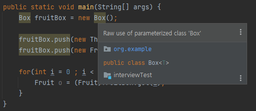
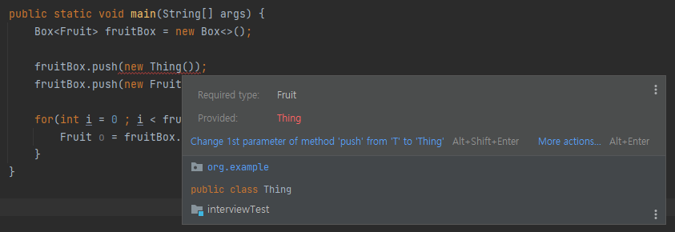
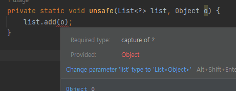

# Item 26. 로 타입은 사용하지 말라.
|용어|설명|
|------|------|
|타입 매개변수</br>type parameter|List&lt;E&gt; 에서 E를 타입 매개변수 혹은 타입 변수라고 한다.
|매개변수화 타입</br>parameterized type|지정된 타입.</br>List&lt;String&gt; 이라면 String이 매개변수화된 타입이다.|
|제네릭 클래스/인터페이스|타입 매개변수를 사용한 클래스와 인터페이스</br>이것들을 통틀어 제네릭 타입이라고 함.</br>List&lt;E&gt;</br>E의 List, List E, List of E 라고 읽으면 된다.|
|로 타입</br>raw type|원시타입. </br>타입 매개변수를 전혀 사용하지 않는 경우.</br>List</br>제네릭 타입을 하나 정의하면 로 타입도 함께 정의됨.|

## 로 타입을 사용하면 안되는 이유는?

### 로 타입을 써보자.
```java
import java.util.ArrayList;
import java.util.List;

public class Box<T> {
    List<T> items = new ArrayList<>();

    public void push(T item) {
        items.add(item);
    }

    public T get(int index) {
        return items.get(index);
    }

    public int getSize() {
        return items.size();
    }
}
```

```java
public class Main {

    public static void main(String[] args) {
        // 로 타입 사용
        Box fruitBox = new Box();

        fruitBox.push(new Thing()); // 실수로 넣었다는 가정..
        fruitBox.push(new Fruit());

        for(int i = 0 ; i < fruitBox.getSize() ; i++) {
            Fruit o = (Fruit)fruitBox.get(i); // 형변환 해야 함.
        }
    }
}

```


* 경고가 뜨지만 아무 오류 없이 컴파일 되고 실행된다.
* 꺼내서 형변환 할 때, `ClassCastException` 발생.
* 사실 문제의 원인은 형번환이 아니라, 잘못 넣은 것이 문제의 원인!</br>
<strong>문제를 겪은 코드와 원인을 제공한 코드가 떨어져 있을 가능성이 크다.</strong>
> ✔ 오류는 가능한 발생 즉시, 이상적으로는 컴파일할 때 발견하는 것이 좋다.

### 매개변수화된 컬렉션을 써보자.
```java
public class Main {

    public static void main(String[] args) {
        // 매개변수화된 컬렉션 사용
        Box<Fruit> fruitBox = new Box<>(); 

        fruitBox.push(new Thing()); // 컴파일 에러
        fruitBox.push(new Fruit());

        for(int i = 0 ; i < fruitBox.getSize() ; i++) {
            Fruit o = fruitBox.get(i); // 형변환 하지 않아도 됨.
        }
    }
}
```

* 컴파일러가 fruitBox에는 Fruit만 넣어야 함을 알기 때문에, <strong>타입 안정성을 확보할 수 있음.</strong>
* 잘못된 타입이면 컴파일 오류 발생.
* 컴파일러가 형변환을 추가

> 💡 지네릭 타입의 제거 (Java의 정석 - 12장)</br>
컴파일러는 지네릭 타입을 이용해서 소스파일을 체크하고, 필요한 곳에 형변환을 넣어주고 지네릭 타입을 제거한다. </br>
즉, 컴파일된 파일(*.class)에는 지네릭 타입에 대한 정보가 없다.
</br></br>
지네릭 타입이 `<T extends Fruit>` 라면 T는 Fruit로 치환된다. </br>
지네릭 타입이 `<T>`라면 Object로 치환된다.

> ✔ 로 타입은 언어 차원에서 막아 놓지 않았지만 절대로 써서 안된다.</br>
로 타입을 사용하면, 제네릭이 안겨주는 안전성과 표현력을 모두 잃는다.

### 그러면 왜 있죠?
* 로타입은 제네릭 도입 전 코드와 호환되기 위함이다.
* 기존 코드와 제네릭을 사용하는 코드가 같이 돌아가야 함.
* 로 타입을 사용하는 메서드에 매개변수화 타입의 인스턴스를 넘겨도, 그 반대로도 동작해야만 했던 것.
* 🚨 그래서 호환성을 위해 로 타입을 지원하고 제네릭 구현에는 소거 방식을 사용한다. (Item 28)

## 로 타입은 안되지만 `List<Object>` 는 괜찮다.
### 무슨 차이인데?
List 는 제네릭 타입에서 완전히 발을 뺀 거고, 
`List<Object>`는 모든 타입을 허용한다는 것을 컴파일러에 명확히 알린 것.

* 매개 변수로 List를 받는 메서드에 `List<String>`을 넘길 수 있지만, `List<Object>` 는 넣을 수 없다.
### 왜?
* 제네릭의 하위 타입 규칙 때문이다.
* 🚨 `List<String>`은 로 타입인 List의 하위 타입이지만, `List<Object>`는 하위 타입이 아니다. (Item 28)
* 그래서 로타입을 사용하면 타입 안전성을 잃게 됨.

```java
public class Main {

    public static void main(String[] args) {
        List<String> strings = new ArrayList<>();
        unsafe(strings, 42);
        String s = strings.get(0);

        // List<Object> objects = new ArrayList<>();
        // unsafe(objects, 42);
    }

    private static void unsafe(List list, Object o) {
        list.add(o);
    }
}
```

위의 매개변수를 `List<Object>`로 바꾸면, 컴파일이 되지도 않는다. `List<String>`이 아니니까.
```java
public class Main {

    public static void main(String[] args) {
        List<String> strings = new ArrayList<>();
        unsafe(strings, 42); // 컴파일 에러
    }

    private static void unsafe(List<Object> list, Object o) {
        list.add(o);
    }
}
```
String은 Object를 상속받지만, `List<String>`은 `List<Object>`가 아님. 상속받지 않음.

## 비한정적 와일드카드 타입
* 제네릭 타입을 쓰고 싶지만, 실제 타입 매개변수가 무엇인지 신경 쓰고 싶지 않을 때, `?`를 써라.
* 어떤 타입이라도 담을 수 있는 가장 범용적임.

### 로 타입과 비한정적 와일드타입의 차이가 뭔데?

* 와일드카드 타입은 안전하고, 로 타입은 안전하지 않다.
* 로 타입 컬렉션에는 아무 원소나 넣을 수 있어서 타입 불변식을 훼손하기 쉬운데, </br>
Collection<?> 에는 null 외에는 어떤 원소도 넣을 수 없음.
* Collection<?>에 어떤 원소도 넣지 못하게 했으니, 컬렉션에서 꺼낼 수 있는 개체의 타입도 알 수 없게 됨. </br>
이런 경우에는 한정적 와일드카드 타입을 사용하면 된다. (Item 31) 💥

## 예외
### 1. class 리터럴에는 로 타입을 써야한다.
* 자바 명세는 class 리터럴에 매개변수화 타입 사용을 하지 못하게 했다.
* 배열과 기본 타입은 허용한다.
* `List.class`, `String[].class`, `int.class` 는 허용하고, </br>
`List<String>`, `List<?>.class`는 허용하지 않는다.

> 💡 클래스 리터럴?</br>
클래스 리터럴이란 클래스, 인터페이스, 배열 타입들의 이름 또는 기본 타입, void 뒤에 "." 이 따라오고 class 토큰이 붙는
형식으로 구성된 표현법
</br> 출처 : https://41d3n.xyz/846

### 2. 런타임에는 제네릭 타입 정보가 지워지므로 매개변수화 타입에 instanceof 연산자는 적용할 수 없다.
* 비한정적 와일드카드 타입은 예외.
* Illegal generic type for instanceof
```java
private static void check(Box box, Object object) {
    if (box instanceof Box<Fruit>) {

    }
}
```