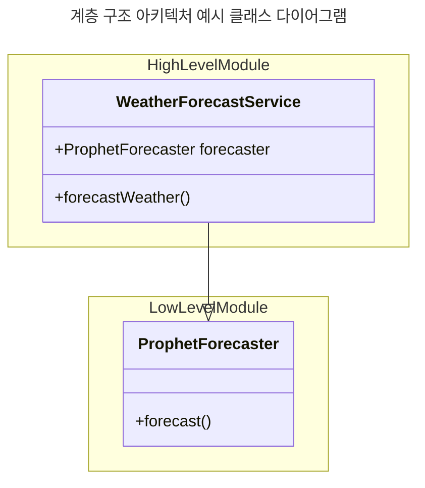
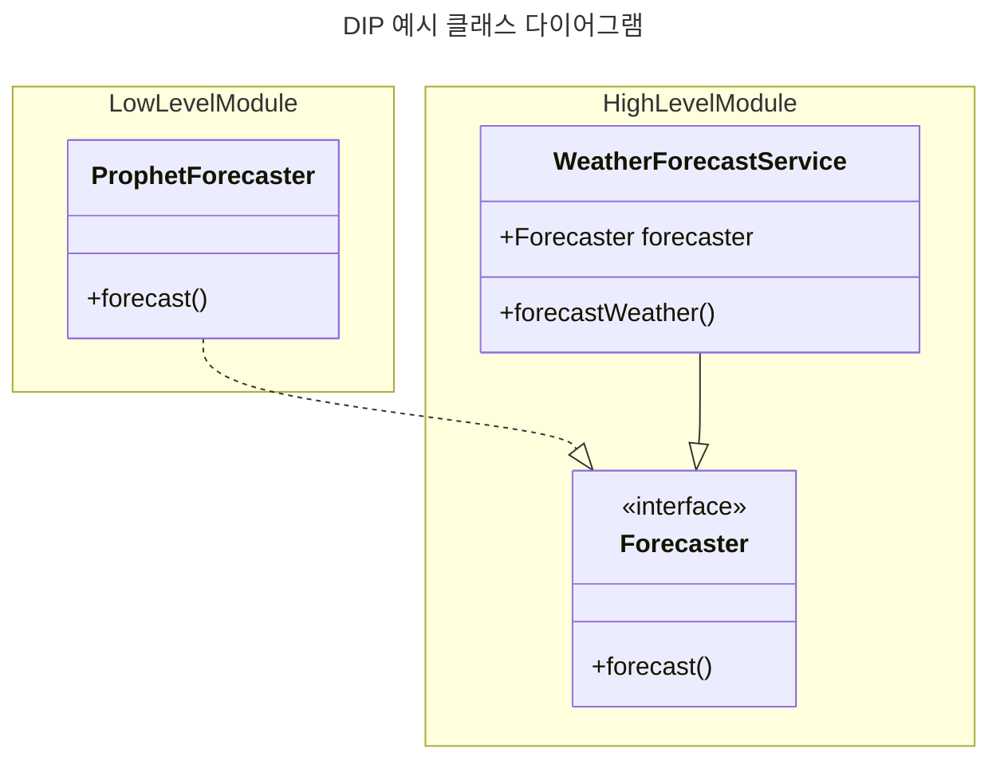
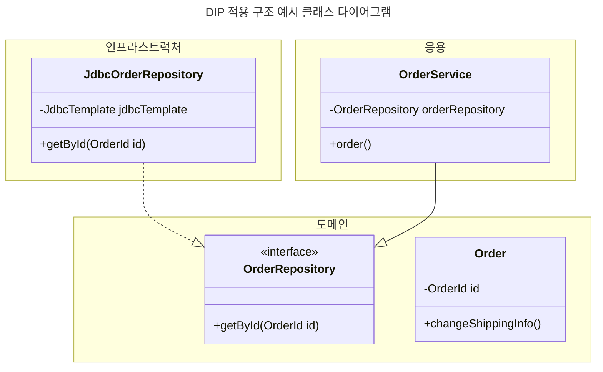

```
👉 DIP 로 저수준 모듈이 고수준 모듈에 의존하도록 하여 계층 구조 아키텍처의 단점을 보완할 수 있음.
👉 하위 기능을 추상화한 인터페이스는 고수준 모듈 관점에서 도출하자.
👉 도메인 코드에 구현 기술 코드가 포함되는게 효과적일 때가 있다. DIP 의 이점을 얻는 수준에서 적용을 고려하자.
```

```
🤔 이해가 어려운
- 78 페이지. 그림 2.13. 도메인 영역의 CalculateDiscountService 는 어떤 역할?

🔍 더 알아보고 싶은
```

# 2.3 DIP
## 고수준 모듈, 저수준 모듈
- 의미 있는 단일 기능을 제공하는 모듈을 <b>고수준 모듈</b> </br>고수준 모듈을 구현하기 위한 하위 기능을 실제로 구현한 것을 <b>저수준 모듈</b>
    - 예시. <br>날씨 예측 기능(고수준 모듈) </br> 날씨 데이터 조회 API 모듈, Prophet 예측 모듈(저수준 모듈)
- 고수준 모듈이 저수준 모듈에 의존하면, 계층형 아키텍처의 문제가 발생.



## DIP
- Dipendency Inversion Principle
- <b>추상화한 인터페이스</b>로 저수준 모듈이 고수준 모듈에 의존하도록 함.

### 예시


- 예측하는 기능을 추상화한 `Forecaster` 인터페이스는 고수준 모듈로, Service 가 더이상 구현 기술에 의존하지 않고 고수준 모듈에 의존하게 됨.
- 저수준모듈이 고수준 모듈에 의존하게 됨.

### 장점
- 실제 구현체가 없어도 테스트 할 수 있음.

### 주의점
- 하위 기능을 추상화한 인터페이스는 `고수준 모듈 관점`에서 도출해야함.
- 도메인 코드에 구현 기술 코드가 포함되는게 효과적일 때가 있음. DIP 의 이점을 얻는 수준에서 적용을 검토.

### DIP 를 적용한 구조 예시
