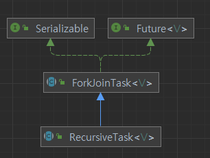

```
👉
```
# Chapter 7. 병렬 데이터 처리와 성능


## 병렬 스트림


## JMH (Java Microbenchmark Harness)

### dependency
```xml
<dependencies>
    <!-- https://mvnrepository.com/artifact/org.openjdk.jmh/jmh-core -->
    <dependency>
        <groupId>org.openjdk.jmh</groupId>
        <artifactId>jmh-core</artifactId>
        <version>1.37</version>
    </dependency>
    <!-- https://mvnrepository.com/artifact/org.openjdk.jmh/jmh-generator-annprocess -->
    <dependency>
        <groupId>org.openjdk.jmh</groupId>
        <artifactId>jmh-generator-annprocess</artifactId>
        <version>1.37</version>
    </dependency>
</dependencies>
```

### code
```java
@State(Scope.Benchmark)
@BenchmarkMode({Mode.AverageTime})
@OutputTimeUnit(TimeUnit.MILLISECONDS)
@Fork(
    value = 2,
    jvmArgs = {"-Xms2G", "-Xmx2G"}
)
public class BenchMarkTest {
    
    @Benchmark
    public int testParallelStream() {
        return this.parallelStream();
    }
}
```

- `@TearDown annotation is placed within a class not having @State annotation. This is prohibited because it would have no effect.`

## 포크/조인 프레임워크

> ✔ 포크 (fork)</br>
소프트웨어 소스 코드를 통째로 복사해서 새로운 독립적인 소프트웨어를 개발하는 것,</br>
또는 프로세스가 자신을 복제해 각기 다른 작업을 수행케 하는 동작 또는 행위를 의미한다. </br>
포크 조인 프레임워크에서 포크는 두 번째의 의미로 해석하면 될 것 같다.</br>
복제 대상을 부모 프로세스라 하고 결과물을 자식 프로세스라고 한다.</br>
참고 : https://ko.wikipedia.org/wiki/%ED%8F%AC%ED%81%AC_(%EC%86%8C%ED%94%84%ED%8A%B8%EC%9B%A8%EC%96%B4_%EA%B0%9C%EB%B0%9C)

- 조인(join) 은 합치다라는 뜻으로, 포크/조인은 여러 프로세스로 작업하고 결과를 합친다는 뜻 같다.

> ❓ 포크 조인 모델 </br>

참고 : https://en.wikipedia.org/wiki/Fork%E2%80%93join_model

### RecursiveTask 구현

- V : 결과 타입
- 실습 : [RecursiveTask 실습](RecursiveTask_Prac.md)

### ForkJoinTask 메소드
#### join() 
- get() 메소드와 다르게 비정상적인 결과일 때 `ExecutionException` 이 아닌 `RuntimeException` 이나 `Error` 를 발생. 호출자 스레드의 인터럽트로 `InterruptedException` 예외를 발생시키며 갑자기 중단되지 않음.

#### get()
- 계산이 완료될 때 까지 기다리고, 결과를 조회 
- throws
    - CancellationException
    - ExecutionException
    - InterruptedException

#### fork()
- 현재 태스크가 실행 중인 풀 혹은 현재 스레드가 `ForkJoinWorkerThread` 가 아니라면 `ForkJoinPool.commonPool()` 을 사용해서 태스크를 비동기적으로 실행하도록 예약. 

### 포크/조인 프레임워크 팁
- `join` 메소드는 태스크가 완료될 때까지, 호출자를 블록시키기 때문에 서브태스크를 모두 시작한 다음에 join 을 호출.
- RecursiveTask 내부에서 `invoke` 메서드는 순차 코드에서 병렬 계산을 시작할 때만 사용하고, `compute` 나 `fork` 메서드를 사용.
- compute 메소드로 같은 스레드를 재사용할 수 있기 때문에, 한 서브태스크는 fork, 한 서브태스크는 compute 메서드를 사용하는 것이 효율적.
- fork 라는 다른 스레드에서 compute 를 호출하는 병렬 계산이라 디버깅 어려움.
- 병렬처리가 항상 빠른 것은 아님. 병렬 처리가 순차 처리를 비교하는데에는 아래 사항 고려.
    - 태스크를 독립적인 서브태스크로 분할할 수 있는지.
    - 서브태스크 실행 시간이 포킹 시간보다 긴지.
    - 컴파일러 최적화는 병렬보다는 순차 버전에 집중될 수 있음. (컴파일러 최적화로 사용되는 않는 계산은 아예 삭제하여 최적화를 할 수 있음.)

### 작업 훔치기(work-stealing)
- 병렬화된 각각의 태스크는 여러 요인으로 같은 시간에 끝나지 않을 수 있음.
- 이 문제를 해결하기 위해 포크 조인 프레임워크는 `작업 훔치기` 알고리즘을 사용.
- 각각의 스레드는 자신에게 할당된 태스크 큐의 헤드에서부터 태스크를 가져와 작업을 처리하는데, 만약 스레드가 모든 태스크를 완료하면 다른 스레드의 큐의 꼬리부터 작업을 훔쳐 진행한다.
- 스레드 간 작업 부하를 비슷하게 맞출 수 있음.
```
❓ TODO
workQueue
 - 작업 훔치기에서 나온 스레드 별 큐는 `ForkJoinWorkerThread` 의 `workerQueue` 와 관련있는 것 같음.
```
