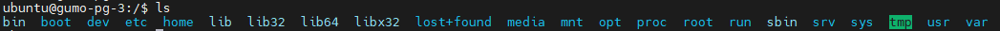

# FHS (Filesystem Hierachy Standard)

> 참고 사진

- `man hier` (hier = hierachy) 명령어로 확인할 수 있음.

| 디렉토리 | 설명 |
| --- | --- |
| `/` | 루트 디렉토리로. 파일 시스템 트리의 시작점. |
| `/bin` | 단일 사용자 모드나 시스템 부팅, 복구에 필요한 기본적인 명령어 바이너리(executable).   예시) cat, ls, cp |
| `/boot` | 부트로더에 필요한 정적 파일.   예시) kernels, initrd|
| `/dev` | 실제 장치를 참조하는 특수 파일(디바이스 파일).   예시) /dev/null , /dev/tty , /dev/random|
| `/etc` | 시스템에 적용되는 설정 파일. 대부분의 프로그램은 이 경로에서 설정 파일을 찾음.  etcetera(기타 등 등) 의 의미.|
| `/etc/opt` | `/opt`에 설치된 애드온 전용 설정 파일. |
| `/etc/sgml` | SGML 을 처리하는 소프트웨어의 설정 파일. |
| `/etc/skel` | 새 사용자 계정을 만들 때, 이 디렉토리의 파일이 해당 사용자의 홈 디렉토리에 복사됨. |
| `/etc/X11` | X11 윈도우 시스템의 설정 파일. |
| `/etc/xml` | XML 을 처리하는 소프트웨어의 설정 파일. |
| `/home` | 사용자의 홈 디렉토리. |
| `/lib` | 시스템 부팅과 루트 파일 시스템 명령 실행에 필요한 공유 라이브러리.   /bin과 /sbin에 있는 바이너리에 필수적인 라이브러리 |
| `/lib<qual>` | 여러 바이너리 형식을 지원하는 시스템에서 각 형식에 맞는 별도의 라이브러리를 제공하는 `/lib`의 변형 디렉토리.   예시) lib32, lib64 |
| `/lost+found` | 파일 시스템 오류나 시스템 충돌로 손상된 파일 조각들이 복구되어 저장되는 디렉토리. |
| `/media` | CD, DVD, USB 등의 이동식 미디어를 마운트하는 디렉토리.|
| `/mnt` | 임시로 마운트된 파일 시스템을 위한 마운트 지점.|
| `/opt` | 추가 소프트웨어 패키지를 설치하는 디렉토리. (Add-on application software packages) |
| `/proc` | 실행 중인 프로세스 및 커널에 대한 정보를 제공하는 `proc` 가상 파일 시스템의 마운트 지점. |
| `/root` | 루트 사용자(root)의 홈 디렉토리. |
| `/sbin` | `/bin`과 유사하게 시스템 부팅에 필요한 명령어.   예시) fsck, init, route |
| `/srv` | 시스템에서 서비스되는 사이트별 데이터. |
| `/sys` | 커널 정보를 제공하는 `sysfs` 파일 시스템의 마운트 지점. `/proc`과 유사하지만 구조화된 형식. |
| `/tmp` | 일시적인(temporary) 파일들이 저장되는 디렉토리. 부팅 시나 주기적인 작업에 의해 삭제될 수 있음. |
| `/usr` | 공유 가능하고 읽기 전용인 데이터만 포함해야 합니다. 여러 시스템에서 마운트될 수 있도록 설계됨. |
| `/usr/bin` | 비필수적인 명령어 바이너리. 일반 사용자들이 실행하는 대부분의 프로그램이 저장되는 디렉토리.|
| `/usr/include` | C 컴파일러가 사용하는 헤더 파일. |
| `/usr/lib` | 동적 라이브러리를 포함한 오브젝트 라이브러리와 일반적으로 직접 실행되지 않는 실행 파일.|
| `/usr/local` | 사이트 전용 프로그램들이 저장되는 디렉토리. (로컬 데이터) |
| `/usr/sbin` | 비필수적인 시스템 바이너리. |
| `/usr/share` | 서로 다른 아키텍처 간에 공유할 수 있는 데이터. |
| `/usr/src` | 참조 용도를 포함한 시스템의 여러 구성 요소의 소스 파일.|
| `/var` | Variable 파일 저장. 스풀 파일, 로그 파일 등 크기가 변할 수 있는 파일 저장. |

## 참고
- [askUbuntu - What is the meaning of the default directories in the Linux filesystem hierachy?](https://askubuntu.com/questions/933/what-is-the-meaning-of-the-default-directories-in-the-linux-filesystem-hierachy)
- [Wikipedia - Filesystem Hierachy Standard](https://en.wikipedia.org/wiki/Filesystem_Hierarchy_Standard)