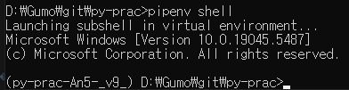

# pipenv
- `프로젝트 별로 격리된 가상 환경과 프로젝트 단위의 패키지 관리 도구`
- 파이썬의 패키지 관리 도구인 pip 는 기본적으로 패키지가 프로젝트 별이 아닌, 전역으로 설치되는데, </br>프로젝트 별 설치를 위해서는 설정이 필요함. 하지만 표준이 모호함. (requirements.txt, setup.py...)
- pipenv 를 사용하면 Pipfile 파일과 Pipfile.lock 파일로 동일한 가상 환경을 구성할 수 있음. (package.json, pom.xml 과 비슷)
- https://pipenv.pypa.io/en/latest/

## 설치
```bash
pip install pipenv
```

## 패키지 설치
```bash
# 프로젝트 디렉토리에서 pipenv 명령어로 패키지 설치
pipenv install <package>
```

### 설치 예시

```bash
# pipenv 패키지 설치 시 로그
>> pipenv install fastapi
Courtesy Notice:
Pipenv found itself running within a virtual environment,  so it will automatically use that environment, instead of  creating its own for any project. You can set
PIPENV_IGNORE_VIRTUALENVS=1 to force pipenv to ignore that environment and create  its own instead.                                                                
You can set PIPENV_VERBOSITY=-1 to suppress this warning.                                                                                                          
Pipfile.lock not found, creating... # Pipfile.lock 파일 생성

Locking [packages] dependencies...

Locking [dev-packages] dependencies...

Updated Pipfile.lock (c48f752b1faa88b8518fb30e2dd92d35b53d7f495af82ecd10aa1cbc7e7aab87)!
To activate this project's virtualenv, run pipenv shell.
Alternatively, run a command inside the virtualenv with pipenv run.
Installing fastapi... # 패키지 설치
Installation Succeeded
To activate this project's virtualenv, run pipenv shell. # pipenv shell
Alternatively, run a command inside the virtualenv with pipenv run.
Installing dependencies from Pipfile.lock (7aab87)...
All dependencies are now up-to-date!
Upgrading fastapi in  dependencies.
Building requirements...
Resolving dependencies...
Success!
Building requirements...
Resolving dependencies...
Success!
To activate this project's virtualenv, run pipenv shell.           
Alternatively, run a command inside the virtualenv with pipenv run.
Installing dependencies from Pipfile.lock (2575b8)...
All dependencies are now up-to-date!
Installing dependencies from Pipfile.lock (2575b8)...

```
- 설치가 완료되면, Pipfile 과 Pipfile.lock 에 패키지 정보가 추가됨.
```yaml
## Pipfile
[[source]]
url = "https://pypi.org/simple"
verify_ssl = true
name = "pypi"

[packages]
fastapi = "*" # 추가됨.

[dev-packages]

[requires]
python_version = "3.13"
python_full_version = "3.13.2"

## Pipfile.lock
{
    "_meta": {},
    "default": {
        "fastapi": {
            "hashes": [],
            "index": "pypi",
            "markers": "python_version >= '3.8'",
            "version": "==0.115.11"
        }
    },
    "develop": {}
}
```

### Pipfile, Pipfile.lock
| 파일 | 설명 |
| --- | --- |
| Pipfile | <li>프로젝트에서 필요한 패키지들의 목록을 정의하는 파일. </br><li>패키지를 설치하거나 제거할 때 이 파일 사용. |
| Pipfile.lock | <li>Pipfile에 정의된 패키지들의 정확한 버전을 고정하여 기록하는 파일. <li>이 파일은 프로젝트의 정확한 환경을 재현할 수 있게 함.|

## 가상 환경 실행
```bash
# fastapi 실행 위해 uvicorn 추가 다운
# fastapi command 사용하여 실행 시 please install "fastapi[standard]"
>> pipenv install uvicorn

# 가상 환경 실행
>> pipenv shell
Launching subshell in virtual environment...

# fastapi 실행
uvicorn main:app --reload
```
- pycharm 내 Terminal 에서는 확인하기 어려워서, cmd 에서 확인



## 패키지 삭제
```bash
pipenv uninstall <package>
```

```bash
# pipenv 패키지 삭제 시 로그
>> pipenv uninstall fastapi
Courtesy Notice:
Pipenv found itself running within a virtual environment,  so it will automatically use that environment, instead of  creating its own for any project. You can set
PIPENV_IGNORE_VIRTUALENVS=1 to force pipenv to ignore that environment and create  its own instead.
You can set PIPENV_VERBOSITY=-1 to suppress this warning.

Removed fastapi from Pipfile.
Uninstalling fastapi...

Found existing installation: fastapi 0.115.11
Uninstalling fastapi-0.115.11:
  Successfully uninstalled fastapi-0.115.11
```

# Trouble Shooting