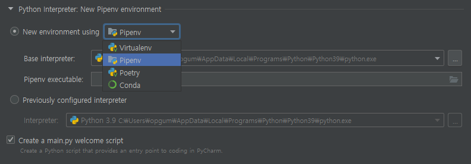
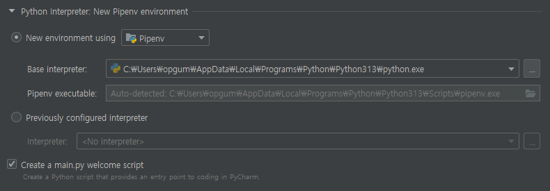

# Pycharm - Create Project
- Create Project 시, Environment 설정 할 수 있음.  
`Virtualenv`, `Pipenv`, `Poetry`, `Conda` 모두 패키지 관리 및 가상 환경 설정 도구.

- pipenv 설치하니 후 Pipenv 선택하니, `Pipenv executable` 에 경로가 자동으로 설정됨. 이 상태로 프로젝트 생성함.

